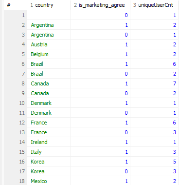

# 입실 체크 해주세요 !! 💌

# 금일 수업 계획
1. Grouping
2. Functions

# Data를 Group으로 '묶어서' '계산합시다.'

## 데이터를 계산하는 함수
- Excel에서 합계를 구하고, 평균을 계산하고, 개수를 세는 것과 같은 작업을 하는 것처럼 SQL에서도 동일한 작업이 가능합니다(그리고 비슷하게 생겼습니다). 문자열을 원하는 만큼 잘라내거나, 대/소문자를 변경하는 등의 함수로 나뉩니다.
  1. 집계 함수 : 합 / 평균 / 개수 세기 etc
  2. 일반 함수 : 문자열 slicing / 대소문자 변경 etc

### 그룹별로 집계 함수를 적용하기 위해 데이터를 나누는 GROUP BY
- 전체 데이터에 함수를 적용하기도 하지만, 그룹별로 수치를 도출하는 경우도 많습니다. 이상의 경우에는 GROUP BY를 이용해 데이터를 그룹으로 묶은 후 필요한 함수를 적용하는 방식을 사용합니다.
  - '국가별 회원 수를 집계해라.'
  - '일별 매출을 계산해라.'
등의 그룹화 기준을 지정하여 계산을 수행.
### GROUP BY로 계산한 결과를 다시 필터링하는 HAVING
- GROUP BY는 말그대로 그룹화하는 경우를 말합니다. 이상에서 언급한 '국가별 회원 수를 집계'하는 것까지만 가능합니다. 하지만 거기에 더해서 '국가별 회원 수를 계산하고, 회원 수가 10 명 이상인 국가만 추출'하는 등의 추가적인 조건을 걸기 위해서는 _그룹화 이후에 조건을 설정_ 해야 합니다. 즉, _집계 함수로 계산한 결과 중에서 조건에 맞는 데이터_ 를 걸어야 합니다.

- 이상에서 중요한 것은 WHERE은 table 자체에 걸리는 조건이기 때문에 집계 함수 이전에 사용이 불가능하다는 점입니다.

### 집계 함수
1. COUNT() - 행(row)의 개수를 계산
2. AVG() - 평균
3. SUM() - 합

1. 예제 
```sql
SELECT COUNT(*) FROM users;
      - 모든 행의 개수를 계산해서 보여달라.
SELECT COUNT(country) FROM users;
      - country 컬럼의 데이터의 개수를 계산해서 보여달라.
```
NULL 체크 여부 때문에 저희 기준으로 77이 나와야 하는데 결과값은 76이 되어야 정상입니다.

- COUNT() 함수는 주어진 컬럼의 값이 null이 아닌 행의 개수를 반환.
2. 예제 : 회원 정보 테이블 users에서 존재하는 국가(country)를 세는 SQL문(중복 제외).
```sql
SELECT COUNT(DISTINCT country) from users;
```
- DISTINCT : 중복을 제외한 결과값을 COUNT할 때 사용.

3. 예제 : 제품 정보 테이블 products에서 최저가를 출력(정상 가격 기준으로).
```sql
SELECT MIN(price) from products;
```

4. 예제 : 제품 정보 테이블 products에서 정상 가격 기준으로 최고가를 출력.
```sql
SELECT MAX(price) from products;
```

5. 예제 : products에서 정상 가격의 합계를 출력.
```sql
SELECT SUM(price) from products;
```

6. 예제 : products에서 discount_price 기준으로 평균을 출력하시오.
```sql
SELECT AVG(discount_price) from products;
```
결과값 : 34.427142857142854
하니까 너무 깁니다. 달러화 기준이니까 소수점 둘째자리까지만 표기하기 위해 중첩 함수를 사용하겠습니다.
```sql
SELECT ROUND(AVG(discount_price), 2) from products;
```
- ROUND(데이터, 소수점표기자리) : 결과값을 소수점표기자리까지만 나타내도록 반올림하는 함수 

7. 예제 : users에서 가입일(day/가입연월일출력) / 가입연월(month/가입연월출력) / 가입일시(created_at/시간까지 출력)
```sql
SELECT SUBSTR(created_at, 1, 10) AS day,
  SUBSTR(created_at, 1, 7) AS month,
  created_at
  FROM users;
```
- SUBSTR(컬럼명, 시작점, 종료점) : 컬럼명에서의 시작점을 기준으로 종료값까지의 데이터를 잘라내서 return
  - 주의 사항 : Java / Python / JS에서의 index 개념과 달리 1부터 시작하며, 종료점이 미만이 아니라 _이하_ 에 해당함.
- 결과적으로 SUBSTR()을 사용하기 위해서는 원본 데이터를 볼 수 있어야 하므로 SELECT created_at FROM users;를 확인 후에 SUBSTR()을 적용해야 할 필요성이 있겠습니다.

- LENGTH() : DB에 따라서 LEN()을 쓰기도 합니다.
8. 예제 : users에서 이메일 문자열의 길이 추출
```sql
SELECT LENGTH(username), username FROM users;
```
#### 집계 함수 요약
1. SUM() / 합계 / SUM(컬럼명)
2. AVG() / 평균 / AVG(컬럼명)
3. MIN() / 최소값 / MIN(컬럼명)
4. MAX() / 최대값 / MAX(컬럼명)
5. COUNT() / 개수 / COUNT(컬럼명)

이상의 5 개는 DB 종류가 달라도 거의 동일하긴 한데, 일부 함수는 DB마다 지원 여부가 다릅니다.

#### 일반 함수 요약 : 데이터를 가공하거나 변형
1. ROUND()
  - 소수점 자리를 지정한 자리수까지 반올림하여 반환 / ROUND(컬럼명, 소수점자리수)
2. SUBSTR()
  - 문자열을 지정한 시작 위치로부터 지정한 문자 개수만큼 가져와 반환 / SUBSTR(컬럼명, 시작점, 문자개수)
3. LENGTH()
  - 문자열의 길이를 반환 / LENGTH(컬럼명)
4. UPPER()
  - 알파벳 문자열을 대문자로 변경하여 반환 / UPPER(컬럼명)
5. LOWER()
  - 알파벳 문자열을 소문자로 변경하여 반환 / LOWER(컬럼명)

- 집계 함수는 _여러 행의 데이터를 하나의 결과값_ 으로 집계하는 반면, 일반 함수는 _한 행의 데이터에 하나의 결과값을 반환_ 한다는 차이점이 있습니다. 

- 이상의 차이 때문에 집계 함수는 _SELECT에서만 사용 가능_ 하지만 일반 함수는 SELECT 뿐만 아니라 WHERE 절에서도 사용 가능합니다. 

## 연습 문제
1. products에서 정상 가격을 모두 더한 값을 구하시오(소수점 둘째자리까지만 표기할 것).
```sql
SELECT ROUND(SUM(price), 2) FROM products;
```
2. products에서 id가 30 이하인 제품의 정상 가격의 평균을 구하시오(단, 소수점 둘째자리까지 표기할 것).
```sql
SELECT ROUND(AVG(price), 2) FROM products WHERE id < 31;
```
3. users에서 가입일시가 2010-10 부터 2010-12까지인 회원 아이디를 중복 없이 센(COUNT) 값을 출력하시오.
```sql
SELECT COUNT(DISTINCT id) from users WHERE SUBSTR(created_at, 1, 7) BETWEEN '2010-10' AND '2010-12';
```
4. users에서 이메일(username)의 길이가 17 자리 이하인 회원 수를 중복 없이 센(COUNT) 값을 출력하시오.
```sql
SELECT COUNT(DISTINCT id) AS userCount from users WHERE LENGTH(username) < 18;
```
## GROUP BY
### 어떤 기준으로 묶어서 '계산'할까?
- 집계함수만으로 원하는 결과를 얻을 수 없을 때가 있습니다. 데이터 전체가 아니라 원하는 기준으로 그룹을 나눠 계산할 일이 있기 때문에. 예를 들어서 전체 회원 수가 아닌 국가별 회원 수를 나누어 계산하기도 하며, 월별로 가입한 회원 수를 집계하기도 합니다.

예제 - users에서 country가 Korea인 회원의 수 출력
```sql
SELECT COUNT(DISTINCT id) AS uniqueUserCnt FROM users WHERE country = 'Korea';
```
이상의 경우에는 한국에 해당하는 숫자만 알 수 있으니까, 미국 따로 일본 따로 브라질 따로 일일이 해야 하는가, 하는 문제가 발생합니다. - 즉, 국가별 회원 수를 전부 알고 싶다면 이상의 쿼리에서 country = '' 부분을 여러 개 작성해야한다는 결론이 나옵니다.

실제 환경에서는 더 많은 데이터를 다루는 만큼, WHERE 절의 조건을 하나하나 바꾸는 방식은 잘 쓰이지 않습니다. 이때 도입되는 것이 GROUP BY입니다.

예제 : users에서 국가별 회원 수를 추출
```sql
SELECT country, COUNT(DISTINCT id) AS uniqueUserCnt from users
  GROUP BY country;
```
GROUP BY는 집계 함수와 함께 사용되며, GROUP BY  기준 컬럼은 SELECT에서 집계 함수를 사용할 때 묶어서 계산을 수행하는 _기준_ 이 됩니다. 그룹으로 나뉜 결과에 따라 집계 함수가 적용되어 결과를 출력합니다.

즉 이상의 SQL문은 'country'의 데이터들을 기준으로 그룹화하라고 했기 때문에 아르헨티나 / 오스트리아 / 벨기에 ... 등으로 country의 각 값들이 일치하는 것들을 기준으로 집계 함수가 개별적으로 적용되었다고 볼 수 있겠습니다.

예제 : users에서 country가 Korea인 회원 중 마케팅 수신 동의한 회원수를 추출하시오(그냥 WHERE 절 쓰셔도 됩니다).
```sql
SELECT COUNT(DISTINCT id) AS uniqueUserCnt from users WHERE country = 'Korea' and is_marketing_agree = 1;
```
이상의 경우는 두 가지 조건을 동시에 적용하여 필터링하고, 집계 함수로 원하는 지표를 추출했습니다.

- 한국 대신 독일에 사는 회원의 마케팅 수신 동의 건수를 확인하려면?
- 한국에 살고 있기는 하지만 마케팅 수신 동의를 하지 않은 회원 수를 확인하려면?

당연히 WHERE절에서의 값을 바꿔주는 것도 가능합니다.

하지만 많은 조건을 걸어야 할 때마다 직접 쿼리를 바꾼다면 시간도 많이 들고 데이터가 누락될 수도 있습니다.

GROUP BY를 활용했을 때, 두 가지 조건을 모두 충족하는 쿼리를 좀 더 쉽게 작성할 수 있습니다.

예제 : suers에서 country 별로 마케팅 수신 동의를 한 회원 수 / 동의하지 않은 회원 수를 동시 추출하겠습니다.

```sql
SELECT country, is_marketing_agree, COUNT(DISTINCT id) as uniqueUserCnt from users
  GROUP BY country, is_marketing_agree
  ORDER BY country ASC, is_marketing_agree DESC;
```
만약에

```sql
SELECT country, is_marketing_agree, COUNT(DISTINCT id) as uniqueUserCnt from users
  GROUP BY country, is_marketing_agree
  ORDER BY country, is_marketing_agree DESC;
```
라고 썼더라도 결과값은 동일합니다. 이유 : ASC가 default

GROUP BY에 두 개 이상의 기준 컬럼을 추가하면 데이터가 여러 그룹으로 나뉩니다. 결과 화면 상에서 Argentina가 입력된 row가 두 개라는 점에 주목하셔야합니다.

하나는 Argentina이면서 is_marketing_agree = 1인 row의 개수(회원 수) / 다른 하나는 Argentina이면서 is_marketing_agree = 0인 row의 개수를 뜻합니다.

이번 예시에서는 country로 먼저 그룹화가 이루어졌습니다.
그 다음, is_marketing_agree를 기준으로 두 번째 그룹화가 다시 이루어졌습니다.

- 이상으로 알 수 있는 중요한 점은 GROUP BY 다음에 복수의 그룹화 조건을 건다면, 그 순서 역시도 매우 중요하다는 점이 됩니다. -> 지정된 컬럼의 순서에 따라 결과가 달라집니다.

- 앞서 등장한 기준으로 한 번 그룹화가 이루어지고, 그 그룹 _내에서_ 그 다음 기준으로 그룹화가 _다시_ 이루어집니다.

예제 : users에서 국가 내 도시별 회원 수를 추출합니다(국가명은 알파벳순으로 정렬하고, 같은 국가 내에서는 회원 수(userCnt) 기준 내림차순으로 정렬할 것).

```sql
SELECT country, city, COUNT(DISTINCT id) AS userCnt from users 
  GROUP BY country, city
  ORDER BY country, userCnt DESC;
```

- 차원(dimension) : 분석 시에 지표를 그룹으로 묶는 기준
- 메트릭(metric) : 각 차원에 대한 연산을 수행할 때 적용하는 계산식

이상의 쿼리문에서의 차원은 country / city에 해당하고, metric은 COUNT(DISTINCT id)에 해당합니다.

예제 : users에서 월별 가입 회원수를 추출할겁니다. created_at을 활용하고, 최신순으로 정렬할겁니다.
```sql
SELECT SUBSTR(created_at, 1, 7) AS month, COUNT(DISTINCT id) AS userCnt from users
  GROUP BY SUBSTR(created_at, 1, 7)
  ORDER BY month DESC;
```
도 가능하고,
```sql
SELECT SUBSTR(created_at, 1, 7) AS month, COUNT(DISTINCT id) AS userCnt from users
  GROUP BY month
  ORDER BY month DESC;
```
도 가능합니다. 함수의 결과값을 기준으로 하는 것도 가능하고, AS를 통해서 새로 이름 지은 컬럼명으로도 가능합니다(DB따라서 다릅니다).

차원 -> 연월
메트릭 -> 회원수

### GROUP BY 요약
1. GROUP BY는 그룹별로 수치를 계산할 때 사용. 쉼표(,)를 써서 그룹화 기준을 복수로 지정 가능.
  - 두 개 이상의 기준을 지정할 때 컬럼 순서에 따라 그룹의 층위가 정해지므로 순서를 명확하게 지정해야 함.

* 참조 : GROUP BY를 쓸 때에는 GROUP BY에 적은 컬럼을 기준으로 SELECT에도 동일한 순서로 적어 계산된 수치의 기준을 알려주면 시인성이 좀 더 좋습니다. 예를 들어 국가 내 도시별 회원 수를 구했는데, 회원 수 컬럼만 출력하면 각 숫자가 어느 국가, 어느 도시의 회원 수인지 알 수 없으므로, 국가와 도시 컬럼도 명확하게 써주는겁니다.

```sql
SELECT COUNT(id) AS userCnt from users GROUP BY country, city; 
```
라고 가정하면 컬럼 하나짜리 테이블이 출력될겁니다. 그럼 그냥 1, 2, 5, 76, ... 로 숫자들만 있는 상황이 될테니까 쿼리를 직접 읽어보지 않는 이상 이게 어느 국가의 어느 도시의 회원 수인지 알지 못하겠네요.

```sql
SELECT 컬럼1, 컬럼2, ...
  GROUP BY 컬럼1, 컬럼2, ...
```
그래서 이상의 정리본을 도입하면
```sql
SELECT country, city, COUNT(id) AS userCnt from users GROUP BY country, city; 
```
와 같이 써주면 좋다는 의미가 되겠습니다.

* 참조 2 : 그리고 기존에 있는 컬럼들을 먼저 써주고, 그것에 대한 연산을 뒤에 써주게 된다면, 차원 / 메트릭이 서로 분리가 되겠죠.
  차원1, 차원2, 연산1, 연산2 같은 순서로요. 실무적으로 봤을 때 데이터 영역이 나뉘기 때문에 좀 더 시인성이 좋습니다.

연습 문제
1. orderdetails에서 주문 아이디 별 주문 수량의 총합을 출력할 것(주문 수량의 총합이 내림 차순으로).
```sql
SELECT order_id, SUM(quantity) AS sumQuantity FROM orderdetails GROUP BY order_id ORDER BY sumQuantity DESC;
```
2. orders에서 직원 아이디 별, 회원 아이디 별로 주문 건수를 출력할 것(단, 직원 아이디 기준 오름 차순으로 먼저 정렬한 뒤, 주문 건수 기준 내림 차순으로 정렬할 것).
```sql
SELECT staff_id, user_id, COUNT(*) AS cnt FROM orders GROUP BY staff_id, user_id ORDER BY staff_id, cnt DESC;
```
3. orders에서 월별로 주문한 회원 수를 출력할 것(주문일자(order_date) 컬럼을 활용하고, 최신 순으로 정렬할 것).
```sql
SELECT SUBSTR(order_date, 1, 7) AS month, COUNT(DISTINCT user_id) AS userCnt FROM orders GROup BY month ORDER BY month DESC;
```

## HAVING
- 집계 값을 다시 필터링하는 HAVING
- 이전까지의 수업에서 GROUP BY를 이용하여 데이터를 그룹화하고, 해당 그룹별로 집계 함수를 사용하여 연산을 수행했습니다. 이 방법으로 국가별 회원 수를 추출하는 작업을 수행했습니다.

- 그렇다면 여기서 추가적으로 국가별 회원 수가 n 명 이상인 국가의 회원 수만 보기 위해서는,
  1. 먼저 집계 함수를 도입하기 위해 SELECT 절에는 집계 함수를 사용할 것이고,
  2. 조건이 아니라 GROUPING을 진행해야 할겁니다.
  3. 그리고 GROUPING의 결과값에 조건을 걸 필요가 있습니다.

예제 : users에서 country가 Korea / USA / France인 회원 수를 국가별로 출력하시오.

```sql
SELECT country, COUNT(DISTINCT id) as userCnt
  FROM users
  WHERE country IN ('Korea', 'USA', 'France')
  GROUP BY country;
```
France = 9 / Korea = 8 / USA = 11 이라는 결과값이 나옵니다.

3개국에 해당하는 국가의 회원 수 말고, 회원 수가 8 명 이상인 국가의 회원 수를 미리 확인하지 않고 바로 SQL문으로 해결하는 방법을 기준으로 하겠습니다.

SELECT country, COUNT(DISTINCT id) as userCnt FROM users WHERE COUNT(DISTINCT id) > 7 GROUP BY country;

일단 일반적으로 생각할 수 있는 방식이 WHERE이 조건절이니까 집계함수의 결과값이 7 초과면 되지 않을까, 라고 생각하셨다면 현재까지 잘 배운 상태라고 할 수 있을겁니다.

그런데 집계 함수는 어디에만 쓸 수 있었다? -> SELECT 절에. 그래서 invalid use of function이라는 alert이 떴습니다.

근데 또 짜증나게 HAVING에서는 집계함수 결과값이 사용 가능합니다.

그래서 정답은

```sql
SELECT country, COUNT(DISTINCT id) AS userCnt 
  FROM users 
  GROUP BY country
  HAVING COUNT(DISTINCT id) > 7
  ORDER BY 2 DESC;

# 가능

SELECT country, COUNT(DISTINCT id) AS userCnt 
  FROM users 
  GROUP BY country
  HAVING userCnt > 7
  ORDER BY 2 DESC;

# 가능
```

* WHERE 절에서 필터링할 때 에러가 난 이유 :
  - 실행하는 쿼리의 순서와 관계있습니다.
  - WHERE의 경우 GROUP BY보다 먼저 실행되며, 컴퓨터가 그룹화를 하기 이전에 조건을 검토하는데, 집계함수로 계산된 값은 GROUP BY 실행 후에 계산되기 때문에 순서상의 오류가 나옵니다.

  - 정확한 순서에 관련한 부분은 HAVING 전체 정리 부분에서 도입하겠습니다(밥먹고 하겠습니다).